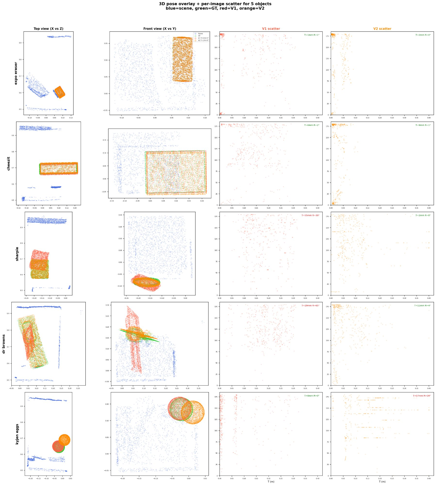
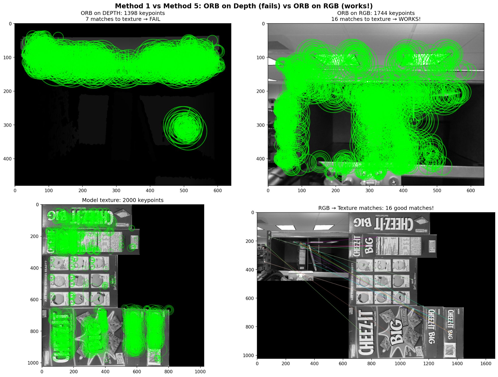
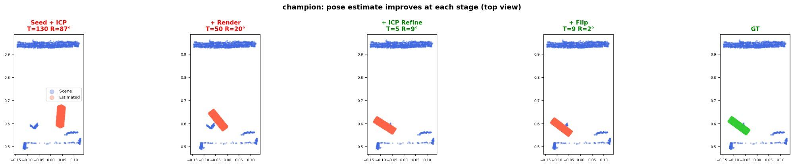

# 6DOF Pose Estimation for Warehouse Object Picking

> **A classical RGB-D pipeline that recovers object pose without deep learning — and a diagnosis of exactly why fusing two weak modalities beats either alone.**

Given a known 3D model and a dashcam-style RGB-D image of an object in a warehouse bin, recover its full 6-degree-of-freedom pose (rotation + translation). Evaluated on the Rutgers APC dataset (24 objects, 432 images each).

**V1 (depth only): 17 / 24 acceptable → V2 (PnP + depth fusion): 21 / 24 acceptable. Per-image robot-grade rate 1.8 % → 5.0 %. Graded 9.5 / 10** (ENGG\*6100 Machine Vision, University of Guelph).

---

## Results at a glance

| Pipeline | Objects acceptable (T<25mm, R<15°) | Per-image robot rate |
|---|---|---|
| V1 — depth only | 17 / 24 (71 %) | 1.8 % |
| **V2 — PnP + depth fusion** | **21 / 24 (88 %)** | **5.0 %** |

**5 failures rescued, 1 regression** between V1 and V2.

## The key insight: modalities are complementary, not redundant

A pure-PnP experiment gave **median translation error 3 mm** (excellent) but **median rotation error 166°** (essentially random) — because ORB feature matches cluster spatially, constraining position but not orientation. Depth-render is the opposite: good rotation, bad translation when seeds miss.

V2 fuses them: **PnP for translation, depth-render for rotation, ICP to refine, and a confidence-gated "smart flip" stage** that resolves the 180° depth ambiguity without breaking already-correct poses.

## The ablation finding

No single pipeline stage is universally helpful — each of seed+ICP, render-compare, ICP-refine, and flip helps ~50 % of images and hurts the other ~50 %. They rescue *different* images, and multi-view voting across 432 frames selects where the right stages aligned. This is why the pipeline is structurally tied to having many viewpoints.

## Read more

- **[Full report (PDF)](report/MV_Project3_FinalReport.pdf)**
- [Methodology](docs/methodology.md) · [Results](docs/results.md) · [References](docs/references.md)

## A note on code

Solution code is kept private in line with course academic-integrity policy. I'm happy to walk through the implementation and design decisions with anyone interested — just reach out.

## Author

**Antony Gerold Arockiasamy** · MEng Computer Engineering, University of Guelph · ENGG\*6100 Machine Vision.

## License

Documentation and figures: MIT — see [LICENSE](LICENSE).
