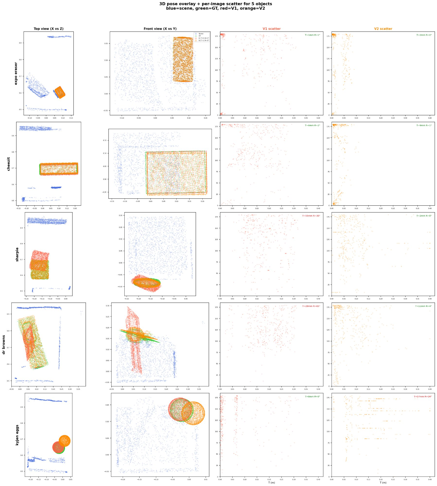
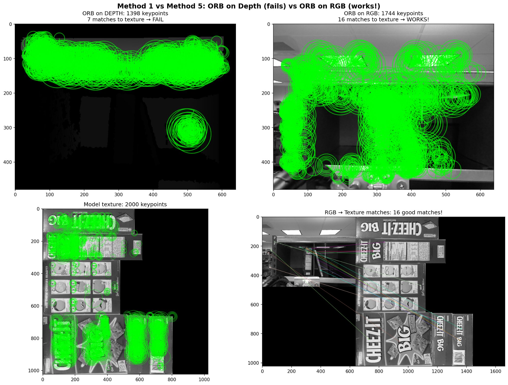
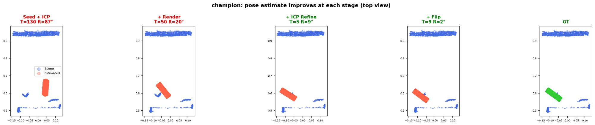

# 6DOF Pose Estimation for Warehouse Object Picking

Two classical pipelines that recover the 3D position and orientation of a known object on a warehouse shelf from RGB-D data, without deep learning. Evaluated on the Rutgers APC RGB-D dataset (24 objects, 432 images each: 12 shelf bins × 36 viewpoints).

**V1 (depth only): 17/24 objects acceptable. V2 (PnP + depth fusion): 21/24 acceptable (T < 25 mm, R < 15°). Per-image success about 2% to about 5% (2.8×).** ENGG\*6100 Machine Vision, University of Guelph.

*3D pose overlay and per-image scatter for five objects (Figure 5 of the report). Each scatter dot is one of about 432 images.*

---

## Results at a glance

| Pipeline | Objects acceptable (T < 25 mm, R < 15°) | Per-image success |
|---|---|---|
| V1, depth only | 17/24 (71%) | about 2% |
| **V2, PnP + depth fusion** | **21/24 (88%)** | **about 5%** |

From V1 to V2: 17 objects, minus 1 regression (kyjen eggs), plus 5 rescued, gives 21.

## The key insight: RGB finds where, depth finds how

*ORB on depth (1398 keypoints, 7 matches, fails) vs ORB on RGB (1744 keypoints, 16 matches, works), with model texture keypoints and RGB-to-texture correspondences (Figure 3 of the report).*

PnP from ORB features gave a median translation error of 3 mm but a median rotation error of 166°. The 16 sparse correspondences cluster on one face of the object, so the EPnP solver cannot constrain rotation. Depth silhouettes encode 3D shape, so depth render-and-compare handles rotation.

V2 fuses them: PnP translation, render-and-compare rotation anchored at that translation, ICP refinement, and a confidence-gated "smart flip" that only flips when confidence is below 0.3 and the improvement is above 5%.

## How the stages improve a pose

*Champion spark plug through the four pipeline stages, top view (Figure 4 of the report). Seed + ICP: T = 130 mm, R = 87°. Render-compare: R drops to 20°. ICP refinement: T = 5 mm, R = 9°. Flip correction: T = 9 mm, R = 2°.*

## Read more

- **[Full report (PDF)](report/MV_Project3_FinalReport.pdf)**
- [Methodology](docs/methodology.md), [Results](docs/results.md), [References](docs/references.md)

## A note on code

Solution code is kept private in line with course academic-integrity policy. I'm happy to walk through the implementation and design decisions with anyone interested.

## Author

**Antony Gerold Arockiasamy**, MEng Computer Engineering, University of Guelph. ENGG\*6100 Machine Vision.

## License

Documentation and figures: MIT, see [LICENSE](LICENSE).
